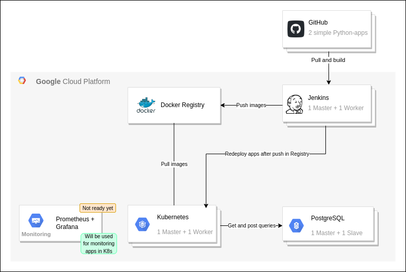

Меня зовут Марат, и это мое портфолио DevOps-инженера.

Чтобы показать свои скилы на практике, я создал инфраструктуру в Google Cloud Platform, развернул на ней несколько систем и настроил их. Код можно <a href="https://github.com/morion-devops" target="_blank">посмотреть тут</a>, а на этой странице — общее описание систем, процессов развертывания и конфигурирования.
 
 <!-- ----------------------------------------------------------------------------------------- -->

## Схема

<!-- ----------------------------------------------------------------------------------------- -->

## IaC Provisioning

Provisioning полностью автоматизирован (*кроме Jenkins, там после установки часть настроек нужно делать руками. Но скоро я поправлю и это*).

1. Сначала подготавливается инфраструктура. Для каждой системы создается одна или две виртуальные машины (с Debian 11), в зависимости от потребностей самой системы. Я намеренно не использую managed-сервисы GCP, а разворачиваю все на голых виртуалках.

   Есть два варианта создания виртуалок:

   * **Terraform**. Для развертывания в облаке, а конкретно — GCP. Создаются инстансы, настраивается ssh-доступ и правила firewall. 
   * **Vagrant**. Для локального развертывания через KVM или Virtualbox.

1. Затем с помощью **Ansible** устанавливаются и конфигурируются системы: устанавливаются зависимости, нужные пакеты, применяются необходимые настройки. Все это описано в плейбуках Ansible.

Теперь расскажу о каждой системе подробнее.

<!-- ----------------------------------------------------------------------------------------- -->

## GitHub

Я создал два очень простых Python-приложения: 

* **<a href="https://github.com/morion-devops/hello" target="_blank">HelloWorld</a>**. Для демонстрации CI/CD. Приложение собирается и деплоится в кластер Kubernetes при помощи Jenkins после каждого коммита в master-ветку.

* **<a href="https://github.com/morion-devops/cpu-load" target="_blank">cpu-load</a>**. Для демонстрации мониторинга Prometheus + Grafana. Приложение генерирует фиктивную нагрузку на CPU, которую потом можно будет увидеть на графиках. Приложение ходит в PostgreSQL, пишет и читает время своего последнего запуска.

   > Prometheus + Grafana еще в процессе настройки, поэтому хоть приложение и генерирует нагрузку, посмотреть графики пока нельзя.

Для обоих приложений описан Dockerfile, чтобы потом собирать образы и разворачивать контейнеры в Kubernetes.

<!-- ----------------------------------------------------------------------------------------- -->

## <a href="https://github.com/morion-devops/jenkins" target="_blank">Jenkins</a>

Jenkins инстанс с двумя нодами: Master и Worker. Настроены пайплайны для сборки и деплоя вышеуказанных приложений. Пайплайны запускаются автоматически через GitHub Webhooks после коммита в master-ветку. 

Что делает Jenkins:

1. Клонирует репозиторий с приложением
1. Собирает его в образ
1. Пушит этот образ в Docker Registry
1. Редеплоит приложение в Kubernetes, чтобы кластер вытянул новую версию образа и перезапустил поды.

Для этого на worker-ноде установлены и настроены git, docker, kubectl.

<!-- ----------------------------------------------------------------------------------------- -->

## <a href="https://github.com/morion-devops/registry" target="_blank">Docker Registry</a>

Инстанс Docker Registry, в котором хранятся образы вышеописанных приложений. 

Настроена авторизация и TLS. Но так как все эти системы нужны лишь для демонстрации, у Registry есть только самоподписанный сертификат. Поэтому каждая система, которая обращается к Registry, настроена так, чтобы игнорировать проверку сертификата.

<!-- ----------------------------------------------------------------------------------------- -->

## <a href="https://github.com/morion-devops/kubernetes" target="_blank">Kubernetes</a>

Кластер, состоящий из двух нод: control-plane и worker. Кластер развернут с помощью kubespray.

Внутри кластера крутятся два приложения из GitHub. Для них настроены ClusterIp и Ingress, чтобы приложения были доступны через веб.

Так как у Docker Regisry самоподписанный сертификат, то containerd по умолчанию блокирует обращение к нему, и это нужно настраивать явно. В kubespray не было такой настройки, поэтому я реализовал эту фичу и <a href="https://github.com/kubernetes-sigs/kubespray/pull/8298" target="_blank">закоммитил ее в upsteram</a>.

Также я добавил еще одну опцию для себя: автоматическая настройка kubectl-конфига для подключения к новому кластеру (подробнее <a href="https://github.com/morion-devops/kubernetes#readme" target="_blank">см. в readme</a>). Чуть позже я также планирую вернуть эту доработку в upstream.

<!-- ----------------------------------------------------------------------------------------- -->

## <a href="https://github.com/morion-devops/postgresql" target="_blank">PostgreSQL</a>

Инстанс PostgreSQL, настроена потоковая репликация Master-slave. Используется в приложении `cpu-load`, чтобы хранить дату последнего запуска приложения.

<!-- ----------------------------------------------------------------------------------------- -->

### *Monitoring (not ready yet)*

Это будет Prometheus + Grafana для мониторинга нагрузки, создаваемой приложением `cpu-load`.

<!-- ----------------------------------------------------------------------------------------- -->

### *Backup (not ready yet)*

Также я планирую настроить создание бекапов для некоторых систем, но пока этого нет.

<!-- ----------------------------------------------------------------------------------------- -->

## А можно все это пощупать?

У меня есть это в планах — настроить read-only access, чтобы системы можно было пощупать и посмотреть, как все это работает.

Но пока этого нет.
